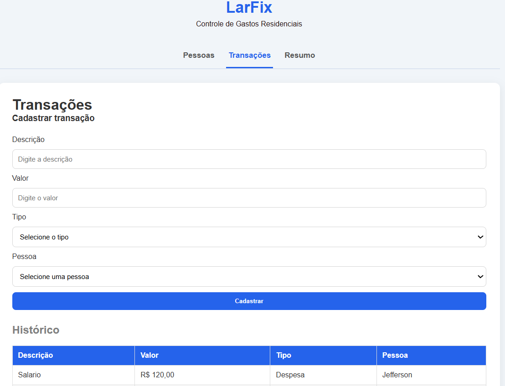
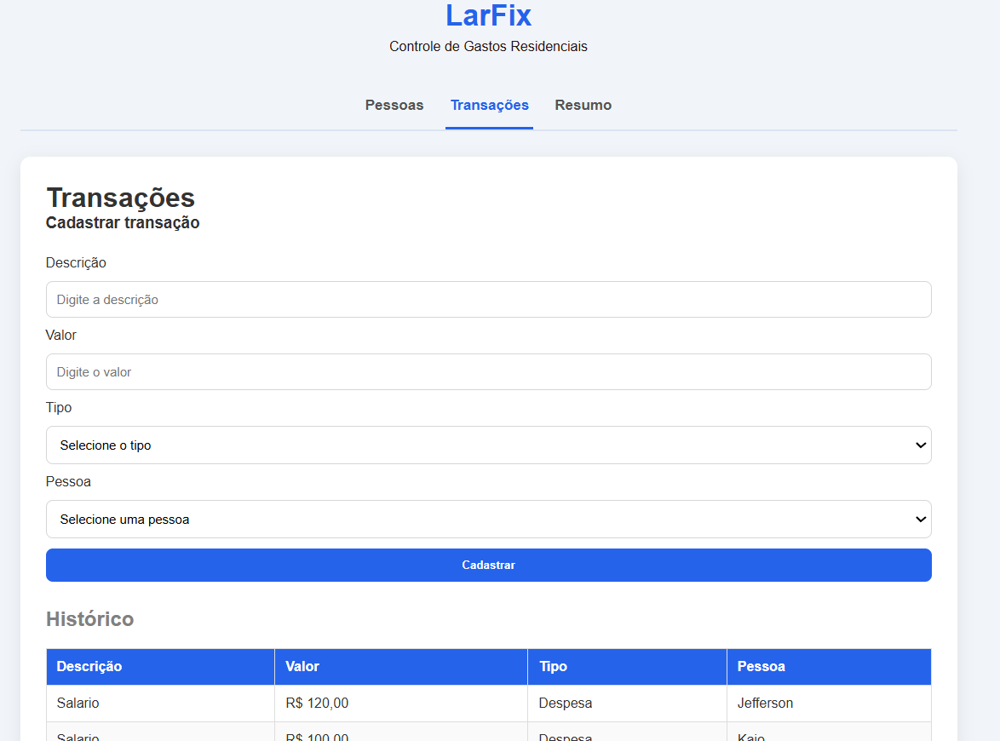

# 🏠 LarFix

Sistema de controle de gastos residenciais desenvolvido como teste técnico para um processo seletivo de estágio em desenvolvimento de software.

O projeto permite cadastrar pessoas, registrar receitas e despesas e visualizar um resumo financeiro geral e por pessoa.

---

# 📸 Telas

## Pessoas



## Transações



## Resumo Financeiro


---

# ✨ Funcionalidades

- Cadastro de pessoas
- Listagem de pessoas
- Exclusão de pessoas
- Cadastro de transações
- Listagem de transações
- Resumo financeiro geral
- Resumo financeiro por pessoa
- Tratamento global de erros
- Validação de dados

---

# 📋 Regras de Negócio

- A pessoa deve existir para cadastrar uma transação.
- Menores de idade podem cadastrar apenas despesas.
- Menores de idade não podem cadastrar receitas.
- Ao excluir uma pessoa, todas as suas transações são removidas automaticamente (Cascade Delete).
- O saldo é calculado pela diferença entre receitas e despesas.

---

# 🛠 Tecnologias

## Backend

- ASP.NET Core Web API (.NET 8)
- Entity Framework Core 8
- SQLite
- Swagger

## Frontend

- React
- TypeScript
- Vite
- Axios
- CSS puro

---

# 📂 Estrutura do Projeto

```
LarFix/
│
├── backend/
│   └── LarFix.Api/
│
├── frontend/
│
└── README.md
```

---

# 🏛 Arquitetura

O projeto utiliza uma arquitetura simples e adequada ao escopo do desafio.

- Controllers responsáveis apenas pelas requisições HTTP.
- Services concentrando toda a regra de negócio.
- Entity Framework Core para acesso aos dados.
- DTOs para comunicação entre API e cliente.
- Middleware global para tratamento de exceções.

Não foram utilizados padrões como CQRS, MediatR ou Generic Repository por serem desnecessários para um projeto deste porte.

---

# 🌐 Endpoints

## Pessoas

| Método | Endpoint             | Descrição         |
| ------ | -------------------- | ----------------- |
| GET    | `/api/Pessoa`        | Lista pessoas     |
| POST   | `/api/Pessoa`        | Cadastra pessoa   |
| DELETE | `/api/Pessoa/{id}`   | Exclui pessoa     |
| GET    | `/api/Pessoa/resumo` | Resumo financeiro |

## Transações

| Método | Endpoint         | Descrição          |
| ------ | ---------------- | ------------------ |
| GET    | `/api/Transacao` | Lista transações   |
| POST   | `/api/Transacao` | Cadastra transação |

---

# ▶️ Como Executar

## Backend

```bash
cd backend/LarFix.Api

dotnet restore

dotnet ef database update

dotnet run
```

A API será iniciada em:

````
https://localhost:5285

(ajuste conforme a porta configurada no seu projeto).

---

## Frontend

```bash
cd frontend

npm install

npm run dev
````

A aplicação será iniciada em:

```
http://localhost:5173
```

---

# 💡 Decisões Técnicas

Durante o desenvolvimento foram adotadas algumas decisões visando simplicidade, organização e facilidade de manutenção.

- Entity Framework Core utilizado como ORM e responsável pelo acesso aos dados.
- Services concentrando toda a regra de negócio.
- Controllers responsáveis apenas pelo fluxo HTTP.
- DTOs separados para Requests e Responses.
- Middleware global para tratamento padronizado de exceções.
- SQLite escolhido pela facilidade de configuração para um projeto de demonstração.
- CSS puro utilizado no frontend para evitar dependências desnecessárias.

---

# 🚀 Melhorias Futuras

- Autenticação de usuários
- Edição de pessoas
- Edição de transações
- Filtros por período
- Paginação
- Dashboard com gráficos
- Testes automatizados
- Deploy em nuvem

---

# 👨‍💻 Autor

**Heitor Rodrigues Araujo**

Desenvolvido como projeto de portfólio e teste técnico utilizando ASP.NET Core, Entity Framework Core, React e TypeScript.
